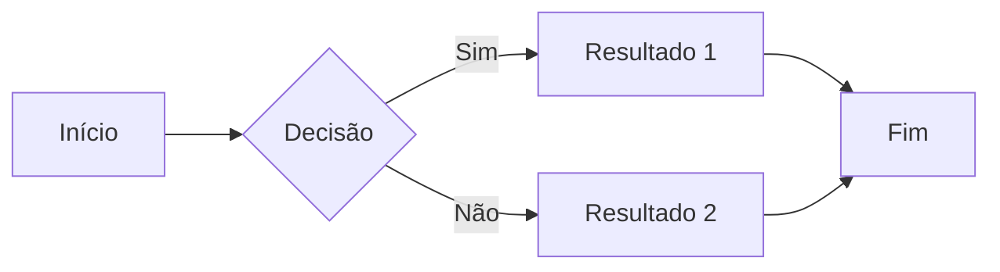

# Comandos e Recursos no Markdown

## 1. `#` (Cabeçalhos)
Usado para criar cabeçalhos de diferentes níveis (de 1 a 6).

### Exemplo:
```md
# Cabeçalho 1
## Cabeçalho 2
### Cabeçalho 3
```

### Variações:
- `# Cabeçalho 1`: Cabeçalho de nível 1.
- `## Cabeçalho 2`: Cabeçalho de nível 2.
- `### Cabeçalho 3`: Cabeçalho de nível 3.
- Até `###### Cabeçalho 6`: Cabeçalho de nível 6.

---

## 2. `*` ou `_` (Itálico)
Usado para formatar o texto em itálico.

### Exemplo:
```md
*texto em itálico*
```
ou
```md
_texto em itálico_
```

### Variações:
- `*texto*` ou `_texto_`: Aplica itálico no texto.
  
---

## 3. `**` ou `__` (Negrito)
Usado para formatar o texto em negrito.

### Exemplo:
```md
**texto em negrito**
```
ou
```md
__texto em negrito__
```

### Variações:
- `**texto**` ou `__texto__`: Aplica negrito no texto.
  
---

## 4. `***` ou `___` (Negrito e Itálico)
Usado para aplicar tanto o negrito quanto o itálico no texto.

### Exemplo:
```md
***texto em negrito e itálico***
```
ou
```md
___texto em negrito e itálico___
```

### Variações:
- `***texto***` ou `___texto___`: Aplica negrito e itálico no texto.

---

## 5. `>` (Citação)
Usado para criar citações ou blocos de texto citados.

### Exemplo:
```md
> Esta é uma citação.
```

### Variações:
- `>>` ou `>>>`: Usados para citações aninhadas.

---

## 6. `-`, `*`, ou `+` (Listas não ordenadas)
Usado para criar listas não ordenadas (com marcadores).

### Exemplo:
```md
- Item 1
- Item 2
- Item 3
```

Ou
```md
* Item 1
* Item 2
* Item 3
```

### Variações:
- `-`, `*`, ou `+`: Usados para criar itens de lista não ordenada.

---

## 7. `1.`, `2.`, `3.` (Listas ordenadas)
Usado para criar listas ordenadas (numeradas).

### Exemplo:
```md
1. Primeiro item
2. Segundo item
3. Terceiro item
```

### Variações:
- Não há variações específicas para esse comando.

---

## 8. `[]()` (Links)
Usado para criar links. O texto do link é colocado entre colchetes `[]`, e a URL é colocada entre parênteses `()`.

### Exemplo:
```md
[Google](https://www.google.com)
```

### Variações:
- `[texto do link](URL)`: Link simples.
- `[texto](#anexo)`: Link para um anexo ou uma âncora interna.

---

## 9. `` (Imagens)
Usado para incluir imagens. O formato é o mesmo de links, mas começa com um ponto de exclamação `!`.

### Exemplo:
```md

```

### Variações:
- Não há variações específicas para esse comando.

---

## 10. `---`, `***`, ou `___` (Linhas horizontais)
Usado para criar linhas horizontais (separadores).

### Exemplo:
```md
---
```

Ou
```md
***
```

Ou
```md
___
```

### Variações:
- `---`, `***`, ou `___`: Qualquer um desses pode ser usado para criar uma linha horizontal.

---

## 11. `code` (Código em linha)
Usado para formatar texto como código em linha.

### Exemplo:
```md
`echo "Hello World"`
```

### Variações:
- Não há variações específicas para esse comando.

---

## 12. ``` (Bloco de código)
Usado para criar blocos de código.

### Exemplo:
<pre>
```bash
echo "Hello, World!"
```
</pre>

### Variações:
- ```<linguagem>``` para especificar a linguagem do código, por exemplo, ` ```python `.

---

## 13. `- [ ]` (Lista de tarefas)
Usado para criar listas de tarefas, com caixas de seleção.

### Exemplo:
```md
- [x] Tarefa 1
- [ ] Tarefa 2
- [ ] Tarefa 3
```

### Variações:
- `- [x]`: Caixa de seleção marcada (tarefa concluída).
- `- [ ]`: Caixa de seleção desmarcada (tarefa pendente).

---

## 14. `\` (Escape de caracteres)
Usado para escapar caracteres especiais no Markdown.

### Exemplo:
```md
\*Texto entre asteriscos não será em itálico\*
```

### Variações:
- `\`: Pode ser usado para escapar qualquer caractere especial no Markdown.

---

## 15. `==` (Destacar texto)
Usado para destacar o texto, criando uma espécie de "marcação".

### Exemplo:
```md
==Texto destacado==
```

### Variações:
- Não há variações específicas para esse comando.

---

# Recursos Avançados do Markdown

## 16. Sublistas
Sublistas permitem aninhar listas dentro de outras listas, criando uma estrutura hierárquica. Para fazer isso, basta adicionar espaços ou tabs antes dos itens das sublistas.

### Exemplo de Lista com Sublistas:
```md
- Item 1
  - Subitem 1.1
  - Subitem 1.2
    - Subsubitem 1.2.1
- Item 2
```

### Dicas:
- Para sublistas, é importante manter a indentação consistente. Normalmente, usa-se dois espaços ou um tab para criar o nível de sublista.
- A forma de escrever sublistas não depende de ser lista numerada ou não numerada. Você pode usar tanto `-`, `*` ou `+` para listas não ordenadas e números para listas ordenadas.

---

## 17. Âncoras
Âncoras permitem vincular diferentes seções ou partes do mesmo documento. Para isso, usamos o ID de um cabeçalho como referência para o link.

### Exemplo de Âncoras:
Primeiro, criamos um cabeçalho com um ID:
```md
## Seção 1 {#secao1}
```
Agora, criamos um link para essa seção:
```md
[Ir para a Seção 1](#secao1)
```

### Dicas:
- O ID da âncora é gerado automaticamente com base no texto do cabeçalho (convertendo os espaços para hífens e removendo caracteres especiais).
- As âncoras são muito úteis em documentos longos ou em wikis, onde você deseja linkar para uma seção específica sem precisar rolar até ela.

---

## 18. Tabelas
Tabelas são uma forma prática de exibir dados de maneira organizada. No Markdown, criamos tabelas com uma combinação de `|` e `-`.

### Exemplo de Tabela:
```md
| Cabeçalho 1 | Cabeçalho 2 |
|-------------|-------------|
| Linha 1, Col 1 | Linha 1, Col 2 |
| Linha 2, Col 1 | Linha 2, Col 2 |
```

### Resultado:
| Cabeçalho 1 | Cabeçalho 2 |
|-------------|-------------|
| Linha 1, Col 1 | Linha 1, Col 2 |
| Linha 2, Col 1 | Linha 2, Col 2 |

### Dicas:
- **Alinhamento**: Você pode alinhar o conteúdo das células com `:` (dois pontos).
  - Alinhamento à esquerda:
    ```md
    | Alinhado à Esquerda | Alinhado à Esquerda |
    |:--------------------|:--------------------|
    ```
  - Alinhamento ao centro:
    ```md
    | Alinhado ao Centro | Alinhado ao Centro |
    |:------------------:|:------------------:|
    ```
  - Alinhamento à direita:
    ```md
    | Alinhado à Direita | Alinhado à Direita |
    |-------------------:|-------------------:|
    ```

---

## 19. Gráficos
Markdown não suporta gráficos diretamente, mas você pode integrar gráficos gerados externamente com imagens ou usar ferramentas específicas para isso, como **Mermaid**.

### Gráficos com Imagens:
Se você já tem

 um gráfico gerado como imagem, pode incluir no Markdown da seguinte maneira:
```md

```

### Gráficos com Mermaid:
Mermaid permite criar gráficos diretamente no Markdown, com uma sintaxe simples:


### Dicas:
- A visualização de gráficos do Mermaid pode depender da plataforma que você está usando para exibir o Markdown (por exemplo, o GitHub suporta Mermaid).

---
